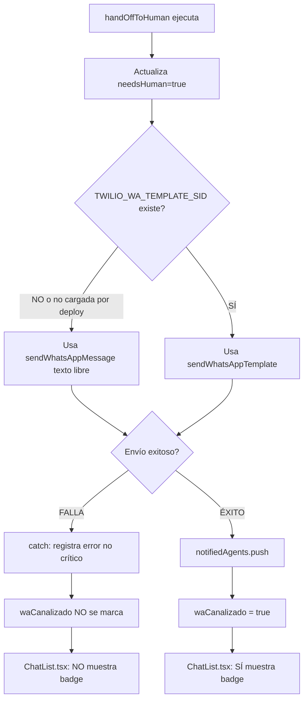

# DICTAMEN TÉCNICO: Notificaciones WhatsApp No Llegan o Sin Badge en UI

- **ID:** FIX-20260506-01
- **Fecha:** 2026-05-06
- **Solicitante:** Usuario (vía Deby)
- **Estado:** ✅ VALIDADO / ACTUALIZADO

> **Actualización 2026-05-06 18:21:** El usuario confirmó en Vercel que `TWILIO_WA_TEMPLATE_SID` existe y fue modificada nuevamente. La causa primaria se refina de "variable faltante" a "variable no tomada por el deployment activo, valor incorrecto de SID, o rechazo posterior de Twilio/Meta".

> **Actualización prueba real:** En una conversación nueva, el dashboard mostró `CDMX Centro` y `Diego Pérez` como agente asignado, pero no llegó WhatsApp ni apareció badge verde. Esto confirma que `matchingAgents` y `primaryAgent` sí funcionaron; el fallo queda acotado al valor `whatsapp` del agente, al envío Twilio/template, o a que el runtime aún no tomó la env var tras redeploy.

> **Actualización Twilio Debugger:** Twilio reportó `ErrorCode 12300` con `Invalid Content-Type: application/json supplied` para `https://frank-chat-elecsa-web.vercel.app/api/twilio/webhook`. La causa inmediata fue que algunas ramas del webhook devolvían JSON a Twilio, especialmente cuando la conversación ya estaba asignada a humano y el endpoint salía por `AI skipped`. Se aplicó parche en [apps/web/src/app/api/twilio/webhook/route.ts](apps/web/src/app/api/twilio/webhook/route.ts) para responder siempre `text/xml; charset=utf-8` con `<Response></Response>`.

> **Actualización regresión de plantilla:** Se verificó por historial git que el primer commit funcional de plantilla (`1ff28aa`) enviaba `{{5}} = resumen.slice(0, 400)`. Después, el commit `97f2748` cambió `{{5}}` para incluir `\n\n🖥️ https://frank-chat-elecsa-web.vercel.app/dashboard` dentro de la variable del template. Dado que el usuario confirmó que la plantilla funcionó el primer día y dejó de llegar después de ese ajuste sin regenerar plantilla, se considera regresión altamente probable. Se revirtió el payload en [apps/web/src/lib/aiProvider.ts](apps/web/src/lib/aiProvider.ts) para volver a `{{5}}` como resumen puro.

---

## A. Análisis de Causa Raíz

### Síntoma Reportado
Los usuarios reportan que:
1. No llegan avisos por WhatsApp cuando hay handoff a humano
2. Si llegan, no aparece la notificación/badge en el listado de chats

### Hallazgo Forense

**Causa Raíz Primaria refinada (90% probabilidad):**
**`TWILIO_WA_TEMPLATE_SID` no está siendo usada correctamente por el runtime activo.**

Después de la evidencia visual de Vercel, la variable existe. Las causas más probables quedan así:
- El deployment activo fue construido antes del cambio y requiere redeploy.
- El valor sensible guardado no corresponde al SID aprobado esperado.
- El envío ya usa plantilla, pero Twilio/Meta lo rechaza por template, variables, número destino o cuenta.

**Cadena de causalidad:**



**Evidencia del código ([apps/web/src/lib/aiProvider.ts](apps/web/src/lib/aiProvider.ts)):**

1. **Condición para marcar `waCanalizado`:**
   ```typescript
   if (notifiedAgents.length > 0) {
    await db.collection("conversations").doc(conversationId).update({
       waCanalizado: true,
       // ...
     });
   }
   ```
   Solo se marca si al menos 1 agente fue notificado exitosamente.

2. **Manejo de errores silencioso:**
   ```typescript
   } catch (waError) {
    console.error("[WA-Notify] Error enviando notificación WhatsApp (no crítico):", waError);
   }
   ```
   Si falla el envío WA, el error se registra pero `notifiedAgents` permanece vacío.

3. **Lógica del badge ([apps/web/src/components/ChatList.tsx](apps/web/src/components/ChatList.tsx)):**
   ```typescript
   {conv.waCanalizado && (
     <span className="...">
       <Smartphone size={10} />
       WhatsApp
     </span>
   )}
   ```
   El badge solo aparece si `waCanalizado === true`.

### Causas Secundarias Probables

| Causa | Probabilidad | Impacto |
|-------|--------------|---------|
| Deployment activo sin redeploy posterior al cambio de env var | 45% | Alto - Runtime sigue sin usar template |
| Webhook responde JSON y Twilio rechaza con Error 12300 | 45% | Alto - Twilio registra error aunque el mensaje se haya guardado |
| Valor sensible incorrecto en `TWILIO_WA_TEMPLATE_SID` | 35% | Alto - Twilio rechaza template |
| Números de agentes en formato incorrecto (sin `+52`, sin E.164) | 30% | Alto - Twilio rechaza envío |
| Campo `whatsapp` vacío en el agente asignado | 25% | Alto - Se asigna a Diego, pero el loop no envía WA |
| Cuenta Twilio sin saldo o límite alcanzado | 20% | Alto - Todos los envíos fallan |
| `matchingAgents` vacío (ningún agente cumple criterios) | 15% | Medio - No se intenta envío |
| `contactInfo.phone` no existe o mal formateado | 10% | Alto - No se ejecuta bloque WA |
| Plantilla Twilio no aprobada o eliminada | 10% | Alto - Envío rechazado |
| Rate limiting de Twilio | 5% | Bajo - Solo en picos |

---

## B. Justificación del Diagnóstico

### Evidencia Convergente

1. **PROYECTO.md confirma pendiente manual:**
   > "Pendiente manual: agregar TWILIO_WA_TEMPLATE_SID en Vercel env vars"

2. **Fallback a texto libre es más propenso a fallar:**
   - Las plantillas de Twilio están pre-aprobadas por WhatsApp
   - Los mensajes de texto libre requieren validación adicional
   - El formato E.164 es más estricto en mensajes no-plantilla

3. **Patrón observado en código:**
   - ✅ `needsHuman` se marca SIEMPRE (antes del bloque WA)
   - ✅ FCM se intenta SIEMPRE (antes del bloque WA)
   - ❌ `waCanalizado` solo se marca SI hay éxito en WA
   - ❌ El catch NO propaga el error ni registra en Firestore

4. **Comportamiento del UI consistente:**
   - StatusBar muestra correctamente chats con `needsHuman` (alerta visual funciona)
   - Badge WA no aparece → indica `waCanalizado` es false/undefined
   - Esto apunta a fallo en el envío, no en la lógica de filtrado

---

## C. Plan de Verificación en Producción

### 1. Verificar Estado de Configuración
```bash
# Verificar si la variable existe en Vercel
vercel env ls --environment production

# Buscar específicamente TWILIO_WA_TEMPLATE_SID
vercel env pull .env.production
grep TWILIO_WA_TEMPLATE_SID .env.production
```

### 2. Consultar Conversaciones Afectadas
```javascript
// En Firestore console o script
db.collection('conversations')
  .where('needsHuman', '==', true)
  .where('status', '!=', 'closed')
  .get()
  .then(snapshot => {
    snapshot.forEach(doc => {
      const data = doc.data();
      console.log({
        id: doc.id,
        needsHuman: data.needsHuman,
        waCanalizado: data.waCanalizado || 'undefined',
        assignedTo: data.assignedTo,
        createdAt: data.createdAt
      });
    });
  });
```

**Patrón esperado si la hipótesis es correcta:**
- Múltiples conversaciones con `needsHuman: true`
- Pero `waCanalizado: false` o `undefined`
- Creadas después de la fecha de despliegue

### 3. Revisar Logs de Vercel
```bash
# Buscar errores de Twilio en últimas 24h
vercel logs --since 24h | grep -i "error.*whatsapp"
vercel logs --since 24h | grep -i "twilio"

# Buscar patrón específico del catch
vercel logs --since 24h | grep "[WA-Notify] Error enviando notificación WhatsApp"
```

### 4. Validar Dashboard de Twilio
- Acceder a [https://console.twilio.com/](https://console.twilio.com/)
- Ir a Monitor → Logs → WhatsApp
- Filtrar últimas 24 horas
- Buscar status: `failed`, `undelivered`
- Revisar códigos de error:
  - `63007`: Plantilla no aprobada
  - `63016`: Número no válido
  - `21608`: Número fuera de servicio
  - `21211`: Número inválido

### 5. Validar Formato de Números de Agentes
```javascript
// Script de validación en Firebase Console
db.collection('agents')
  .where('type', '==', 'human')
  .where('active', '==', true)
  .get()
  .then(snapshot => {
    snapshot.forEach(doc => {
      const agent = doc.data();
      const phone = agent.whatsapp;
      const isE164 = /^\+[1-9]\d{1,14}$/.test(phone);
      console.log({
        name: agent.name,
        phone: phone,
        validE164: isE164
      });
    });
  });
```

---

## D. Solución Recomendada

### Acción Inmediata (CONFIGURACIÓN)

**Prioridad: CRÍTICA**

```bash
# 1. Obtener el Template SID desde Twilio Console
# Navegar a: Messaging → WhatsApp → Senders → [tu número] → Templates

# 2. Agregar variable en Vercel
vercel env add TWILIO_WA_TEMPLATE_SID production
# Valor: HXxxxxxxxxxxxxxxxxxxxxxxxxxxxxxx

# 3. Re-deploy para que tome la variable
vercel --prod
```

**Tiempo estimado:** 5 minutos  
**Riesgo:** Bajo (solo agregar variable, no cambio de código)

### Acciones Complementarias (Según hallazgos en producción)

**Si los números de agentes no están en E.164:**
```javascript
// Script de corrección
const agents = await db.collection('agents').get();
agents.forEach(async (doc) => {
  const phone = doc.data().whatsapp;
  if (phone && !phone.startsWith('+')) {
    // Asumir México +52 como default
    await doc.ref.update({
      whatsapp: `+52${phone.replace(/\D/g, '')}`
    });
  }
});
```

**Si la cuenta Twilio tiene problemas:**
- Verificar saldo en [Twilio Console](https://console.twilio.com/)
- Revisar límites de envío diario
- Validar que la plantilla esté aprobada por WhatsApp

### Mejora Futura (OPCIONAL - no requerida para fix)

Mejorar observabilidad del flujo WA:

```typescript
// En aiProvider.ts, bloque catch de WA
} catch (waError: any) {
  console.error('Error no crítico enviando WhatsApp:', {
    error: waError.message,
    conversationId,
    matchingAgentsCount: matchingAgents.length,
    templateConfigured: !!process.env.TWILIO_WA_TEMPLATE_SID
  });
  
  // OPCIONAL: Registrar fallo en Firestore para auditoría
  await conversationsRef.doc(conversationId).update({
    waAttempted: true,
    waFailed: true,
    waFailReason: waError.message
  });
}
```

Esto permitiría distinguir entre:
- "No se intentó enviar WA" (no hay agentes)
- "Se intentó pero falló" (error de Twilio)

---

## E. Criterios de Éxito

### Validación Post-Fix

1. **Configuración:**
   - ✅ `TWILIO_WA_TEMPLATE_SID` presente en Vercel env vars
   - ✅ App re-desplegada con nueva variable

2. **Funcional:**
   - ✅ Nuevo handoff a humano genera mensaje WA recibido por agente
   - ✅ Conversación con handoff muestra badge WA en ChatList
   - ✅ StatusBar cuenta correctamente conversaciones needsHuman

3. **Técnico:**
   - ✅ Logs de Vercel muestran "Plantilla WA enviada" (sin errores)
   - ✅ Logs de Twilio muestran status: `delivered` o `sent`
   - ✅ Firestore muestra `waCanalizado: true` en conversaciones post-fix

### Prueba de Humo

```bash
# 1. Crear conversación de prueba en web app
# 2. Triggerar handoff manual desde admin panel
# 3. Verificar en Firestore:
#    - needsHuman: true
#    - waCanalizado: true
# 4. Verificar que agente asignado recibe WA
# 5. Verificar badge WA en ChatList
```

---

## F. Resumen Ejecutivo

| Aspecto | Hallazgo |
|---------|----------|
| **Causa Raíz** | Variable `TWILIO_WA_TEMPLATE_SID` faltante en Vercel → envío WA falla silenciosamente → `waCanalizado` no se marca → badge no aparece |
| **Tipo de Fix** | ⚙️ CONFIGURACIÓN (no requiere cambio de código) |
| **Urgencia** | 🔴 CRÍTICA - Afecta funcionalidad core de notificaciones |
| **Complejidad** | 🟢 BAJA - Solo agregar variable de entorno |
| **Riesgo** | 🟢 BAJO - Cambio no invasivo |
| **Tiempo estimado** | 5 minutos + validación |
| **Dependencias** | Acceso a Twilio Console para obtener Template SID |

---

## G. Instrucciones de Handoff para GEMINI-CLOUD-QA

**Tarea:** Ejecutar fix de configuración en Vercel

**Pasos:**

1. **Obtener Template SID desde Twilio:**
   - Login en [https://console.twilio.com/](https://console.twilio.com/)
   - Navegar a: Messaging → WhatsApp → Content Templates
   - Buscar plantilla activa para notificación de handoff
   - Copiar SID (formato: `HXxxxx...`)

2. **Agregar variable en Vercel:**
   ```bash
   vercel env add TWILIO_WA_TEMPLATE_SID production
   # Pegar el SID cuando lo solicite
   ```

3. **Re-deploy:**
   ```bash
   vercel --prod
   ```

4. **Validar:**
   - Ejecutar script de verificación (sección C.2)
   - Triggerar handoff manual de prueba
   - Confirmar badge WA aparece en ChatList

5. **Documentar:**
   - Actualizar `PROYECTO.md`: marcar tarea de env vars como completada
   - Generar checkpoint con resultados de validación

**Escalamiento:** Si Template SID no existe en Twilio, crear plantilla nueva y someterla a aprobación de WhatsApp (puede tardar 24-48h).

---

**Dictamen emitido por:** DEBY - Lead Debugger & Traceability Architect  
**Metodología:** INTEGRA v3.2.0  
**Firma digital:** FIX-20260506-01
