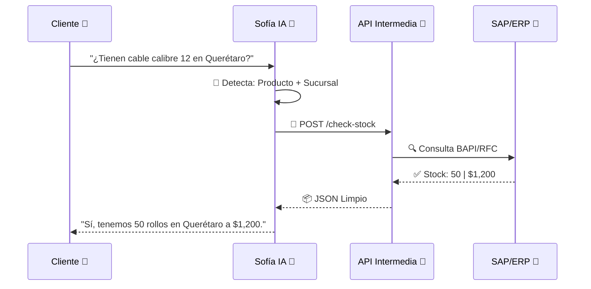

# 🔌 Especificación Técnica: API de Consulta de Precios y Existencias
**Proyecto:** Sofía AI (ELECSA Chat)
**Versión:** 1.1.0 (Formato Visual)

---

## 🎯 1. Objetivo
**Habilitar a Sofía** para que pueda "ver" sus inventarios reales.
Queremos que cuando un cliente pregunte por un cable, Sofía pueda consultar sus sistemas (ERP/SAP) en tiempo real y responder con la verdad: precio actual y si hay stock físico.

---

## 🏗️ 2. Arquitectura Propuesta
Sofía funcionará como un cliente que hace preguntas a su API Intermedia.



### 🇩🇪 2.1 Nota para Entornos SAP
Como usan **SAP**, recomendamos:
*   **Opción A (Moderna):** SAP Gateway (OData). Es lo ideal.
*   **Opción B (Robusta):** Middleware (SAP PI/PO).
*   **Referencia:** Buscar BAPIs como `BAPI_MATERIAL_AVAILABILITY`.

---

## 🔌 3. El "Enchufe" (Endpoint)
Necesitamos que TI habilite una URL segura con estos datos:

*   **Método:** `POST`
*   **Seguridad:** `HTTPS` + `API Key` (para poder apagarla si es necesario).

### 📤 Lo que Sofía envía (Request)
```json
{
  "sku": "CAB-12-THW",       // El código de su producto
  "branch_id": "queretaro",  // La sucursal donde busca
  "quantity": 10             // Cuánto quiere
}
```

### 📥 Lo que Sofía espera recibir (Response)
```json
{
  "found": true,             // ¿Existe?
  "price": {
    "amount": 1250.00,       // Precio
    "currency": "MXN"
  },
  "stock": {
    "available": true,       // ¿Hay stock?
    "message": "Entrega inmediata"
  }
}
```

---

## 🛡️ 4. Reglas de Seguridad
1.  **Solo Lectura:** Sofía NUNCA va a modificar inventarios. Solo "leer".
2.  **Candado:** La API Key es exclusiva para el Chat.

---

## ✅ Checklist para TI
Marcar cuando esté listo:

| Requisito | Estado |
| :--- | :---: |
| Endpoint HTTPS creado | [ ] |
| Conexión a SAP/ERP exitosa | [ ] |
| API Key generada | [ ] |
| Datos de prueba validados | [ ] |

---
*Documento listo para compartir con Sistemas.*
